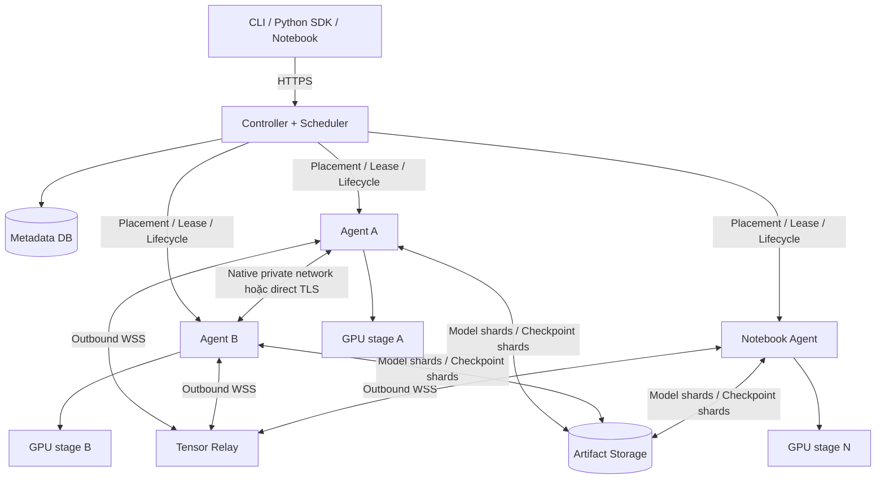

# MeshGPU — Kế hoạch hệ thống GPU phân tán qua networking

Ngày review: 2026-09-07. Trạng thái kế hoạch: thiết kế và backlog; implementation snapshot
được cập nhật ở ngay dưới đây. Workspace hiện đã có source code và correctness tests,
nhưng chưa có benchmark phần cứng đủ để biến các ngưỡng trong tài liệu thành cam kết.
Tên MeshGPU và các API/CLI trong tài liệu vẫn phải được xem là phạm vi hỗ trợ có điều kiện
cho tới khi qua acceptance test tương ứng.

### Implementation snapshot — 2026-09-12

Đã có đường kiểm chứng tự động cho adapter `llama_dense_v1`: chia model Hugging Face
thành stage shard, portable inference prefill/decode + SSE, LoRA/full training cơ bản,
checkpoint/resume, export inference artifact, planner VRAM, recovery/re-shard và các
primitive transport/relay. CLI thực tế gồm `plan`, `convert`, `serve`, `stage-server`
và `fine-tune`; stage inference RPC đã có endpoint single-shard, còn controller chưa
tự động launch topology RPC end-to-end.

Đường mặc định đã kiểm chứng là portable pipeline trong một Python process (nhiều GPU
trên một máy hoặc CPU correctness reference). Controller/agent/relay là nền tảng cho
multi-machine; cross-machine stage execution, native vLLM launch, QUIC/RDMA và provider
notebook thực tế chưa được coi là production-ready nếu chưa có hardware/end-to-end
acceptance report. Vì vậy các checkbox P0–P5 bên dưới vẫn là cổng nghiệm thu, không được
đánh dấu chỉ vì unit test chạy xanh.

## 1. Kết luận review

Hướng xây dựng khả thi: điều phối nhiều GPU để cùng chứa và thực thi một model bằng model sharding; dùng backend phù hợp với topology và workload. Mục tiêu đầu tiên là chạy được model vượt VRAM của một GPU, sau đó tối ưu tốc độ và khả năng phục hồi.

Plan ban đầu cần sửa ở các điểm sau:

| Điểm trong plan cũ | Vấn đề | Quyết định sau review |
| --- | --- | --- |
| “Logical VRAM fabric” | Dễ bị hiểu thành một GPU ảo có VRAM bằng tổng các máy | Định nghĩa sản phẩm là distributed model runtime; không có cam kết chạy nguyên xi mọi chương trình CUDA |
| Cộng VRAM để chọn placement | Thiếu activation, KV cache, workspace, bộ đệm và peak lúc load/all-gather | Lập ngân sách theo từng GPU và theo từng giai đoạn chạy |
| Chọn chế độ dựa vào LAN/WAN | LAN 1 GbE vẫn có thể rất chậm; WAN giữa cloud có thể tốt | Chọn bằng bandwidth hữu dụng, latency, GPU compute và độ ổn định đã đo |
| Một transport cho mọi backend | WebSocket relay không tự thay được NCCL process group | Hai execution backend có điều kiện kết nối riêng; dùng chung control plane |
| Colab/Kaggle như worker luôn sẵn sàng | Thiếu ràng buộc provider, quota, phiên chạy và runtime compatibility | Ma trận hỗ trợ có điều kiện; kiểm chứng từng provider trước khi quảng bá |
| `async_lora` giải quyết thiếu VRAM | Worker độc lập vẫn cần chứa base model; merge adapter không đơn giản | Tách federated adapter training thành nhánh nghiên cứu; dùng sharding cho mục tiêu tăng dung lượng |
| Retry tensor khi mất worker | Tensor có thể đã cập nhật KV cache hoặc gradient trước khi ACK bị mất | Dùng attempt ID, state version và quy tắc replay/rollback rõ ràng |
| Checkpoint ngay trước khi notebook bị ngắt | Không đảm bảo nhận được tín hiệu trước khi runtime chết | Checkpoint định kỳ ra storage bền vững, drain chỉ là tối ưu bổ sung |
| Tự xây cả inference engine lẫn distributed trainer | Phạm vi quá lớn và khó xác nhận tính đúng | Tận dụng PyTorch/vLLM; chỉ xây stage runtime hẹp cho topology mà backend có sẵn không đáp ứng |
| Inference trước, training để cuối | Có thể chọn giao thức không giữ được autograd semantics | Kiểm chứng forward/backward trên model nhỏ ngay trong giai đoạn nền tảng |

Các mô tả backend bên dưới được đối chiếu với tài liệu chính thức. Kiến trúc MeshGPU, công thức ước lượng, ngưỡng kiểm thử và lộ trình là đề xuất kỹ thuật của project, chưa phải kết quả thực nghiệm.

## 2. Mục tiêu, phạm vi và thứ tự ưu tiên

### 2.1. Mục tiêu bắt buộc

1. Một model có thể chia trên nhiều GPU ở nhiều máy, mỗi GPU chỉ giữ phần state cần thiết.
2. Có đường chạy inference và training, với tiêu chí nghiệm thu riêng cho full fine-tuning và LoRA.
3. Agent hỗ trợ máy do người dùng quản lý và môi trường notebook được phép tham gia.
4. Trước khi chạy, giải thích được model có fit không, worker nào giữ phần nào và bottleneck dự kiến.
5. Khi worker mất, hệ thống dừng hoặc phục hồi theo quy tắc xác định; không tiếp tục với state không nhất quán.
6. So sánh công bằng với quantization/offload trên một máy; không mặc định thêm GPU sẽ nhanh hơn.

### 2.2. Phạm vi phiên bản đầu

- Cluster riêng gồm 2–4 GPU NVIDIA, Linux và CUDA/PyTorch trong một compatibility profile đã kiểm thử.
- Controller chạy CPU; không cần GPU để điều phối.
- Một họ dense decoder-only Transformer kiểu Llama, có adapter cụ thể cho model/config được kiểm chứng.
- FP32 cho correctness oracle; FP16 hoặc BF16 cho GPU tùy capability. Không mặc định GPU nào cũng chạy tốt BF16.
- CPU worker dùng cho development/test; không tính vào cam kết hiệu năng GPU.
- Một job training giữ độc quyền GPU trong thời gian chạy. Inference và train dùng chung hệ thống, nhưng chạy đồng thời cần các GPU được phân bổ riêng.
- Single-controller và một trusted relay là đủ cho MVP; có cơ chế restart, chưa cần controller HA.

### 2.3. Ngoài phạm vi MVP

- GPU ảo tương thích mọi CUDA API; remote page fault hoặc paging VRAM qua Internet.
- Mọi kiến trúc model, MoE, diffusion, multimodal và arbitrary Python model tự chia graph.
- Ghép CUDA/ROCm/Metal/TPU vào cùng một collective group.
- Public swarm gồm các máy không tin cậy; marketplace GPU và kiểm chứng kết quả từ bên thứ ba.
- Full pretraining model lớn qua các notebook miễn phí có thể mất bất kỳ lúc nào.
- Transparent live migration của KV cache/optimizer, thay worker giữa optimizer step, hoặc tốc độ tăng tuyến tính theo số GPU.

## 3. Ma trận hỗ trợ môi trường

Các trạng thái dưới đây là mục tiêu triển khai, không phải danh sách đã test.

| Môi trường | Inference | Training | Điều kiện |
| --- | --- | --- | --- |
| Một máy Linux, nhiều GPU NVIDIA | Ưu tiên backend native | FSDP2 hoặc pipeline đã test | Driver, kernel, dtype và version phù hợp |
| Nhiều máy Linux có network riêng | Native hoặc portable pipeline | FSDP2; pipeline khi phù hợp | Kết nối peer cần thiết và benchmark đạt yêu cầu |
| Máy cá nhân/cloud qua Internet | Portable pipeline có điều kiện | Pipeline cố định: experimental | Outbound tới controller/relay; đủ throughput và thời gian phiên |
| Windows qua WSL2 | Giai đoạn sau | Giai đoạn sau | Kiểm chứng CUDA, spawn process và networking thực tế |
| macOS/AMD | Client/controller trước; GPU backend sau | Chưa cam kết | Backend riêng, cần bộ test và profile độc lập |
| Colab managed miễn phí | Notebook đơn máy hoặc client tương tác | Notebook đơn máy | Không đưa vào pool distributed worker |
| Colab managed có gói trả phí và compute units dương | Thử nghiệm có điều kiện | Thử nghiệm có điều kiện | Ràng buộc provider và transport phải phù hợp |
| Colab local runtime trên máy tự quản lý | Theo khả năng máy phía sau | Theo khả năng máy phía sau | UI Colab không tạo thêm GPU |
| Kaggle | Notebook adapter: experimental | Job hữu hạn: experimental | Internet bật nếu cần network; phiên và quyền sử dụng phù hợp |

Colab FAQ hiện liệt kê “running distributed computing workers” trong nhóm bị cấm khi dùng managed runtime miễn phí không có compute units dương. Gói trả phí vẫn chịu các hạn chế chung, bao gồm remote proxies. Vì vậy outbound relay không tự chứng minh workflow được phép. [Colab FAQ](https://research.google.com/colaboratory/faq.html)

Kaggle có cấu hình Internet theo session; một số competition yêu cầu tắt Internet. Tài liệu notebook không đủ để khẳng định mọi kiểu distributed worker đều được hỗ trợ: phải kiểm tra workflow mục tiêu, giới hạn phiên và kết nối trên tài khoản thử nghiệm. Không hard-code quota hay loại GPU. [Kaggle Notebooks](https://www.kaggle.com/docs/notebooks)

Provider adapter phải phân biệt `client`, `single_runtime_job` và `distributed_worker`. Nếu một provider không đáp ứng chế độ worker, vẫn có thể hỗ trợ notebook local hoặc thao tác submit/monitor phù hợp, nhưng không tính VRAM của nó vào cluster.

## 4. Tận dụng backend hiện có

### 4.1. Hai execution backend dùng chung controller

| Backend | Vai trò | Phần MeshGPU phụ trách |
| --- | --- | --- |
| `native` | Inference vLLM; training PyTorch FSDP2; pipeline PyTorch khi phù hợp | Preflight, topology, placement/config, launch, lifecycle, checkpoint metadata |
| `portable_pipeline` | Stage RPC qua kết nối ứng dụng có xác thực, hỗ trợ outbound worker | Chia layer, session state, tensor transport, backpressure, recovery |

vLLM hỗ trợ tensor/pipeline parallel cho model được hỗ trợ và yêu cầu execution environment nhất quán giữa các node. Backend này phù hợp cho cluster ổn định; không coi vLLM là một engine có thể gắn thẳng transport WebSocket tùy ý. [vLLM Parallelism and Scaling](https://docs.vllm.ai/en/latest/serving/parallelism_scaling/)

FSDP2 là backend training mặc định. DeepSpeed ZeRO-3 là lựa chọn bổ sung khi có workload chứng minh cần tính năng của nó; không duy trì cả hai integration đầy đủ ngay từ đầu. ZeRO có các mức phân chia optimizer, gradient và parameter, nên phải chọn đúng stage thay vì chỉ bật “distributed”. [DeepSpeed ZeRO](https://www.deepspeed.ai/tutorials/zero/)

PyTorch pipeline là ứng viên cho training trên cluster cố định. API hiện được tài liệu đánh dấu alpha; shape/dtype của communication buffer và schedule phải kiểm chứng trên version đã pin. Portable RPC cần tự nối backward giữa stage; không giả định autograd tự đi xuyên socket. [PyTorch Pipeline Parallelism](https://docs.pytorch.org/docs/2.14/distributed.pipelining.html)

### 4.2. Spike đánh giá trước khi viết runtime lớn

- Petals: đánh giá private swarm, model adapter, session/recovery và phần có thể tái sử dụng. Dự án đã làm distributed inference/fine-tuning; đó là bằng chứng hướng tiếp cận khả thi, không phải benchmark của MeshGPU. [Petals](https://github.com/bigscience-workshop/petals)
- llama.cpp RPC: làm baseline inference cho thiết bị không đồng nhất nếu model/format phù hợp. Tài liệu RPC tự đánh dấu proof of concept và cảnh báo không mở ra network công cộng; chỉ đánh giá trong môi trường riêng. Không chọn làm training backend. [llama.cpp RPC](https://github.com/ggml-org/llama.cpp/blob/master/tools/rpc/README.md)
- Hivemind: tham khảo giao tiếp và parameter averaging qua Internet cho nhánh training nghiên cứu. Khả năng trong Hivemind không mặc nhiên áp dụng được cho mọi dense model. [Hivemind](https://github.com/learning-at-home/hivemind)

Đầu ra spike là một quyết định có bằng chứng: reuse backend nào, điểm nào thiếu, chi phí tích hợp và test nào chưa qua. Phần riêng của MeshGPU tập trung vào planner, onboarding, lifecycle và trường hợp outbound pipeline; không fork toàn bộ engine nếu chưa cần.

## 5. Kiến trúc và quyền sở hữu state



Các đường controller–agent trong hình là quan hệ điều khiển logic. Với outbound worker, command được gửi trên kết nối do agent mở sẵn; controller không cần gọi vào một inbound port của notebook.

| Thành phần | State sở hữu | Trách nhiệm |
| --- | --- | --- |
| Controller | Job spec, placement version, lease epoch, checkpoint manifest, trạng thái job | Điều phối và admission control; không giữ bản duy nhất của model/optimizer |
| Agent supervisor | Worker identity, session incarnation, process con, giới hạn tài nguyên | Preflight, nhận lease, start/stop/drain và báo lỗi |
| GPU process | Weight shard, KV cache hoặc optimizer/activation của stage | Thực thi tensor operation đã định nghĩa |
| Inference session owner | Prompt token IDs, prefix đã xác nhận, sampling state, route version | Điều phối decode và replay; v0 mất owner thì request báo lỗi |
| Relay | Bounded frame queues và route đang sống | Chuyển frame; không hiểu CUDA pointer hoặc thực thi model |
| Artifact storage | Weight shards bất biến, checkpoint hoàn chỉnh, tokenizer/config | Phục hồi khi worker/controller restart |

Controller có thể dùng SQLite trên persistent disk cho MVP, một writer và transaction cho lease/checkpoint pointer. Production nhiều controller mới chuyển DB/leader election tương ứng. Controller và relay có thể cùng một máy nhưng là module/process riêng với resource budget riêng.

Agent chạy một GPU subprocess cho mỗi device được cấp. Vòng heartbeat/I/O không chạy cùng luồng Python bị forward/backward chặn. Cài đặt trên notebook dùng package Python và process thường; không yêu cầu Docker daemon hoặc quyền root.

## 6. Networking và giao thức

### 6.1. Control plane

- HTTPS cho register, submit, status, cancel; persistent WSS cho heartbeat và command.
- Join token một lần đổi thành credential ngắn hạn, có scope worker/job và khả năng revoke.
- Mỗi lần agent restart có `worker_incarnation` mới; mỗi lần cấp lại job có `lease_epoch` mới để loại message cũ.
- Khởi điểm thử nghiệm: heartbeat 5 giây, suspect sau 3 lần thiếu; execution deadline cấu hình riêng. Các giá trị phải tune theo jitter quan sát được.
- Nếu mất controller, job chỉ chạy tiếp trong lease đã cấp. Hết lease thì dừng ở boundary an toàn hoặc abort; không tự nhận việc mới.

### 6.2. Data plane

`native`: giữ transport/process group do backend hỗ trợ. NCCL socket dùng TCP; RDMA chỉ bật khi GPU, NIC, driver và route thực sự hỗ trợ. Native preflight phải kiểm tra kết nối cần thiết giữa peer, không chỉ cổng rendezvous. Một WSS connection đến controller không đủ cho NCCL. [NCCL Network Configuration](https://docs.nvidia.com/deeplearning/nccl/user-guide/docs/env.html)

`portable_pipeline`: MVP chọn binary WebSocket trên TLS/TCP để dùng được outbound 443. Direct TLS/WSS trên máy tự quản lý là đường tối ưu; relay là đường kết nối khi không có direct route và workflow cho phép. QUIC chỉ đánh giá sau benchmark, vì UDP có thể không khả dụng và đổi protocol không loại được độ trễ vật lý.

Luồng truyền phổ thông:

```text
GPU A → pinned CPU buffer → socket → [relay nếu cần] → CPU buffer → GPU B
```

Không gọi đây là zero-copy GPU-to-GPU. Đo riêng D2H, packing, network, H2D và synchronization. Buffer chỉ được tái sử dụng khi CUDA event và socket ownership cho phép. Dùng ring buffer giới hạn dung lượng; tăng overlap sau khi test đúng.

Relay chia control/data connection để tensor lớn không chặn heartbeat. Mỗi job có credit theo byte, queue limit và deadline; sender chờ credit khi receiver chậm. Benchmark có thể bắt đầu bằng frame 1 MiB và sweep 256 KiB–4 MiB; giữ frame nhỏ cho decode, không chờ đủ chunk lớn.

### 6.3. Frame và operation semantics

Metadata cần có:

```text
protocol_version, cluster_id, job_id, placement_version, lease_epoch
worker_incarnation, request_id, attempt_id, operation_id
stage_id, phase, training_step, microbatch_id, token_position
tensor_id, dtype, shape, layout, byte_length
chunk_index, chunk_count, payload_checksum
```

Metadata có schema version; payload là raw contiguous tensor bytes với dtype/endian/layout quy định. Không serialize arbitrary Python object qua network. Kiểm tra overflow khi tính shape × itemsize, giới hạn tensor/frame trước allocation, và đối chiếu schema stage.

TCP đã đảm nhiệm ordering/retransmission trong một connection. ACK ở tầng ứng dụng dùng để xác nhận operation/state và xử lý reconnect, không tự viết lại TCP. Checksum không thay cho authentication.

`operation_id` duy nhất trong attempt. Worker chỉ trả lại kết quả đã cache nếu biết operation hoàn tất và state vẫn còn đúng version. Nếu không xác định được đã cập nhật state hay chưa, hủy attempt để replay/rollback; không chạy lại mù quáng. Dedupe cache có giới hạn và không được quảng bá là exactly-once qua worker restart.

## 7. Memory planner và cost model

### 7.1. Tính capacity theo từng GPU

Ngân sách đề xuất:

```text
usable_i = min(user_budget_i, free_memory_at_admission_i - reserve_i)
peak_i   = max(load_peak_i, forward_peak_i, backward_peak_i,
               optimizer_peak_i, checkpoint_peak_i)
Điều kiện: peak_i <= usable_i trên mọi GPU tham gia
```

Reserve khởi điểm: `max(1 GiB, 10% physical VRAM)`, cho phép override và hiệu chỉnh bằng số đo. Agent phải probe lại ngay trước load vì VRAM trống có thể thay đổi. Ngân sách planner không phải cơ chế cách ly cứng đối với process ngoài MeshGPU.

Inference peak gồm weight, KV cache, activation tạm, workspace, CUDA context, communication buffer, allocator fragmentation và phần dư do graph capture nếu dùng. Training thêm gradient, optimizer state, master parameters nếu có, activation còn sống và unsharded/prefetch buffers.

FSDP2 cần all-gather parameter group khi thực thi. Chia storage đều không bảo đảm peak fit: planner còn phải chứa được group đang unshard và phần prefetch. Chọn wrapping theo block và đo thực tế. [FSDP2 fully_shard](https://docs.pytorch.org/docs/2.14/distributed.fsdp.fully_shard.html)

Host RAM, pinned RAM và disk cũng có ngân sách. CPU/NVMe offload không được phép biến thành host OOM; checkpoint bất đồng bộ có thể cần thêm bản sao state đáng kể.

### 7.2. Ví dụ dung lượng, không phải cam kết model fit

Quy ước: GB = 10^9 bytes, GiB = 2^30 bytes.

| Thành phần giả định | Công thức | Model 8 tỷ parameter |
| --- | --- | --- |
| Weight FP16/BF16 | `P × 2` | 16 GB ≈ 14.90 GiB |
| Weight 4-bit lý tưởng | `P × 0.5` | 4 GB ≈ 3.73 GiB, chưa có scale/metadata/unquantized tensors |
| Ví dụ mixed-precision Adam | `P × (2 weight + 2 grad + 4 master + 8 moments)` | 128 GB ≈ 119.21 GiB, chưa có activation/buffer |

Cấu hình Adam trên chỉ là một cách lưu state; implementation có thể dùng dtype/bản sao khác. Full fine-tuning không được ước lượng bằng dung lượng file weight. QLoRA giữ base quantized và train adapter; nó không tương đương train toàn bộ base model ở 4-bit. [PEFT Quantization](https://huggingface.co/docs/peft/developer_guides/quantization)

Với attention thông thường có GQA, KV cache của một stage chưa chia KV head bằng tensor parallel có ước lượng:

```text
KV_bytes = 2 × batch × cached_tokens × local_layers
             × num_kv_heads × head_dim × bytes_per_element
```

Ví dụ `batch=1, tokens=8192, layers=32, kv_heads=8, head_dim=128, bytes=2` cho 1 GiB KV toàn model. Đây là minh họa cho cấu hình trên; MHA, sliding window, cache quantization, padding và allocation granularity cho kết quả khác. Planner phải lấy config thực tế và số request đồng thời.

### 7.3. Chi phí activation qua network

Với một boundary truyền hidden state `[B, S, H]`:

```text
A_bytes = B × S × H × dtype_bytes
transfer_time >= A_bytes / measured_goodput
```

Ví dụ tự tính `B=1, S=4096, H=4096, FP16`: 32 MiB cho mỗi boundary forward.

| Link speed lý tưởng | Thời gian tối thiểu để truyền 32 MiB một lần |
| --- | --- |
| 100 Mbit/s | 2.68 giây |
| 1 Gbit/s | 268 ms |
| 10 Gbit/s | 26.8 ms |

Số này chưa tính latency, relay, protocol, CPU copies hay traffic khác. Training còn truyền gradient ngược với kích thước tương ứng cho boundary này. Chia nhỏ frame chỉ giúp streaming/overlap khi stage thực sự tiêu thụ incremental; nó không làm mất tổng số byte phải truyền.

Decode một token trong ví dụ trên chỉ gửi 8 KiB hidden state, nhưng token sau phụ thuộc token trước. Nếu tổng thời gian giao tiếp trên vòng decode đã đo là 120 ms/token thì trần do network là khoảng 8.3 token/s cho một sequence, trước khi cộng compute. Microbatch nhiều request tăng throughput chung, không tự giảm vòng phụ thuộc của một request.

### 7.4. Placement theo topology

Planner v0 dùng contiguous layer partition, tìm kiếm trên số stage nhỏ; chưa cần optimizer phức tạp.

1. Lọc worker theo provider eligibility, model kernel, dtype, version và ngân sách.
2. Đo block compute trên từng GPU ở các shape dự kiến; đo đường direct/relay cả hai chiều.
3. Đưa embedding, output head, tied weights, KV và boundary tensors vào chi phí thật.
4. Sinh partition không đều theo capacity và compute, ưu tiên ít boundary chậm.
5. Chọn objective: fit-first, latency hoặc throughput; không gộp tất cả thành một điểm số không giải thích được.
6. Dry-run warmup đúng context/batch, đo peak; nếu không fit thì giảm batch/context theo policy hoặc báo không khả thi.
7. Xuất placement report và giữ placement cố định trong attempt/job segment.

Một GPU lớn hơn có thể nhận nhiều layer hơn, nhưng GPU chậm vẫn có thể thành bottleneck. Ước lượng pipeline throughput dùng service time của stage chậm nhất; latency của một request dùng tổng compute và các communication dependency. Thêm GPU khi model đã fit chỉ thực hiện nếu số đo cho thấy có lợi.

## 8. Inference runtime

### 8.1. Stage contract

- Adapter định nghĩa embedding, danh sách transformer blocks, final norm, output head, mask/position và KV layout.
- Version đầu hỗ trợ một config/model cụ thể; tied weight ở hai đầu phải có quy tắc ownership/replication rõ ràng, config chưa hỗ trợ bị từ chối.
- Worker tải đúng tensor shard theo manifest bất biến, không load toàn model lên GPU rồi mới xóa layer.
- Weight trên mỗi stage giữ resident qua nhiều token. Nếu format file chưa chia đúng layer, khâu chuẩn bị artifact tách shard trước và tính thêm host/disk peak.
- KV cache ở GPU sở hữu layer tương ứng; không truyền toàn bộ KV cache mỗi token.
- Sampling đặt ở stage cuối/session owner gần stage cuối; token ID quay về stage đầu. Không gửi toàn logits vocabulary qua WAN trừ API cần và đã tính chi phí.

### 8.2. Prefill và decode

Prefill chạy prompt theo context limit. Chunked prefill chỉ bật khi adapter chứng minh mask, position và cache update đúng; chia byte frame không tương đương chia attention sequence.

MVP bắt đầu với một request và greedy decode; tiếp theo là batch cố định và streaming token có sequence number. Continuous batching, paged KV và CUDA graphs do backend native cung cấp hoặc triển khai sau cho portable backend. Không bắt phiên bản đầu phải tự tái tạo toàn bộ serving engine của vLLM.

Admission control reserve KV cho `prompt_length + max_new_tokens`, batch và concurrency được chấp nhận. Hết capacity thì queue/reject có deadline; không nhận thêm request rồi hy vọng allocator còn chỗ.

### 8.3. Worker mất khi đang decode

MVP trả lỗi có cấu trúc và kết thúc stream nếu stage mất. SDK có thể submit lại request mới; không âm thầm ghép phần đầu cũ với output mới.

Giai đoạn recovery nâng cao: cố định model revision, lưu prompt + generated token prefix đã xác nhận + RNG state, chọn route mới và replay prefix để dựng KV. Token đã phát ra phải được giữ nguyên trong prefix; sequence number giúp client dedupe. Không có đủ GPU thay thế thì job chờ hoặc thất bại theo deadline.

Cold recovery phải tải weight và rebuild KV, nên có thể mất lâu hơn nhiều so với reconnect. Replica dự phòng làm giảm thời gian này nhưng tiêu tốn thêm VRAM; planner phải thể hiện trade-off.

## 9. Training runtime

### 9.1. Phân biệt các chế độ

| Chế độ | Giảm yêu cầu chứa một model trên một GPU? | Vai trò |
| --- | --- | --- |
| DDP thuần | Không chia parameter/optimizer storage mặc định | Baseline throughput khi mỗi GPU đã chứa được model |
| FSDP2 / ZeRO-3 | Có chia state; còn peak unshard | Full fine-tuning trên cluster ổn định |
| Pipeline full training | Có, theo stage | Model lớn và GPU không đều; cần schedule/backward đúng |
| Pipeline LoRA | Có chia base model và adapter theo stage | Fine-tuning nhẹ hơn nhưng vẫn phải truyền gradient qua boundary |
| Local/federated LoRA replicas | Không chia base giữa các replica | Thử nghiệm training ít đồng bộ nếu mỗi replica đã fit |

### 9.2. Native training là đường chính

Triển khai FSDP2 trước: một nhóm worker cố định, profile môi trường thống nhất, layer wrapping, activation checkpointing, mixed precision và sharded checkpoint. Full fine-tuning trên model nhỏ phải qua correctness test trước khi tăng model size.

PEFT/QLoRA thêm bằng một compatibility recipe riêng. Không mặc định tổ hợp quantizer + FSDP + optimizer + kernel nào cũng hoạt động. CPU offload là lựa chọn cần benchmark host RAM và bandwidth; NVMe offload chỉ thêm qua backend có implementation phù hợp.

Mỗi training config xác định global batch theo số token/sample thực sự tham gia, microbatch, accumulation và data-parallel degree. Đổi world size phải giữ hoặc chủ động thay đổi effective batch, LR policy và sampler state theo rule đã ghi trong job.

### 9.3. Portable pipeline training

Giữ nguyên weight version trong toàn bộ accumulation window. Stage sở hữu parameter, gradient và optimizer state của phần mình. Forward nhận tensor từ mạng, tạo boundary tensor phục vụ autograd cục bộ; backward nhận `dL/doutput`, chạy graph cục bộ rồi trả `dL/dinput` về stage trước.

Base weight được freeze không có nghĩa được bọc cả stage trong `no_grad()`: gradient vẫn có thể cần đi qua frozen block để cập nhật adapter hoặc layer phía trước. Activation/recompute metadata và RNG cho dropout phải tồn tại tới backward tương ứng.

Trình tự triển khai: một microbatch forward/backward → GPipe flush schedule → 1F1B sau khi correctness/peak-memory được kiểm chứng. Ban đầu dùng shape buckets cố định cho sequence/batch; final partial microbatch phải có padding/mask và loss normalization đúng.

Các invariant bắt buộc:

- Mọi stage dùng cùng model/adapter revision, step và accumulation window.
- Loss được chuẩn hóa theo tổng valid tokens của global batch; không average tùy ý các microbatch có chiều dài khác nhau.
- Nếu dùng global gradient clipping, tính norm trên các parameter shard có ownership xác định, không clip riêng từng stage rồi coi là tương đương.
- Nếu mixed-precision phát hiện overflow, mọi stage thống nhất skip/update và scaler state.
- Tied parameters xuất hiện ở nhiều stage cần gradient reduction và update nhất quán; v0 từ chối cấu hình này nếu chưa hỗ trợ.
- Chỉ optimizer-step khi backward/reduction của window hoàn tất. Không chấp nhận gradient stale từ attempt trước.

WAN pipeline training được đánh dấu experimental dù backward test đã qua. Muốn công bố sử dụng được cần chứng minh time-to-quality, checkpoint overhead và tỷ lệ thời gian chờ network trên workload thật.

### 9.4. Điều chỉnh đề xuất `async_lora`

Không đặt federated LoRA vào critical path giải quyết VRAM. Nếu mỗi worker độc lập giữ một base model thì model vẫn phải fit trên worker đó hoặc trên một nhóm GPU nội bộ của replica.

Ngoài ra, với `ΔW = B × A`, nói chung `avg(B) × avg(A) != avg(B × A)`. Do đó averaging hai factor là một thuật toán khác, không thể gọi là merge weight delta chính xác. Nếu nghiên cứu nhánh này phải định nghĩa thuật toán, base revision, weighting theo dữ liệu, giới hạn staleness, rank và validation set.

DiLoCo là tham khảo cho training với nhiều bước local giữa các lần đồng bộ; nó không tự biến VRAM của các replica thành một pool dùng chung. Nhánh này cần benchmark convergence riêng thay vì chỉ chứng minh truyền ít byte. [DiLoCo](https://arxiv.org/abs/2311.08105)

## 10. Checkpoint và phục hồi

### 10.1. State machine

```text
PENDING → PREFLIGHT → RESERVED → LOADING → WARMUP → RUNNING
RUNNING → CHECKPOINTING → RUNNING
RUNNING → DRAINING → STOPPED
RUNNING → RECOVERING → LOADING hoặc FAILED
Bất kỳ trạng thái đang hoạt động → CANCELLING → CANCELLED
```

Mỗi transition ghi `reason`, `attempt_id`, `lease_epoch` và timestamp. Cancel phải giải phóng process/buffer/lease; lỗi heartbeat không được coi ngay là trạng thái optimizer đã biết.

### 10.2. Checkpoint training bền vững

Checkpoint bao gồm model/adapter shards, optimizer, scheduler, scaler, RNG từng rank/stage, global step, data cursor/sampler, accumulation policy, model/tokenizer/config hash, placement và software profile.

V0 chỉ checkpoint ở ranh giới sau optimizer step và khi không còn partial accumulation. Để bất đồng bộ hóa, phải có snapshot bất biến hoặc staging copy hoàn tất trước khi training sửa state tiếp; tính RAM của snapshot vào planner.

Commit protocol đề xuất:

1. Tất cả stage/rank chụp state ở cùng logical step.
2. Upload shard vào prefix checkpoint mới, có kích thước và hash.
3. Controller xác nhận đủ shard và metadata khớp.
4. Ghi manifest hoàn chỉnh; cập nhật committed-checkpoint pointer bằng transaction/conditional update.
5. Chỉ manifest đã commit mới được dùng để resume. Upload dở không được quảng bá thành checkpoint mới nhất.

PyTorch Distributed Checkpoint hỗ trợ sharded save/load và load-time resharding. Tuy nhiên tương thích giữa các phiên bản PyTorch không được bảo đảm; pin môi trường và test resume với topology cần hỗ trợ. Đổi số stage của custom pipeline còn cần remap theo parameter name và optimizer ownership. [PyTorch Distributed Checkpoint](https://docs.pytorch.org/docs/2.14/distributed.checkpoint.html)

### 10.3. Khi worker mất giữa step

Abort toàn bộ attempt của nhóm training bị ảnh hưởng. Nếu một số stage đã optimizer-step còn stage khác chưa hoàn tất, toàn nhóm quay về checkpoint đã commit; không suy đoán trạng thái dựa trên ACK cuối cùng.

Native launch có thể restart worker group, nhưng script vẫn phải tự load checkpoint và data state; restart process không tự phục hồi optimizer. [torchrun Failure Modes](https://docs.pytorch.org/docs/2.14/elastic/run.html)

V0 resume cùng topology trước. Đổi world size/partition chỉ bật sau bộ test riêng, với placement epoch mới và quy tắc effective batch/sampler rõ ràng. Không cam kết bitwise identical khi đổi hardware/topology.

### 10.4. Chi phí và giới hạn recovery

Checkpoint định kỳ theo thời gian hoặc step, cộng best-effort checkpoint khi drain. Chọn chu kỳ bằng số đo thời gian save và mức chấp nhận mất tiến độ; không dựa vào dự đoán chính xác thời điểm notebook bị thu hồi.

Ví dụ tự tính: checkpoint 20 GiB qua uplink 100 Mbit/s mất tối thiểu khoảng 28.6 phút nếu phải đi qua một uplink đó. Full optimizer checkpoint qua Internet có thể làm workflow không thực tế; adapter checkpoint nhỏ hơn hoặc training trong cluster có storage gần là lựa chọn cần so sánh.

Phân biệt rõ:

- RPO: phần training sau checkpoint bền vững gần nhất có thể phải chạy lại.
- RTO: phát hiện lỗi + chờ GPU thay thế + tải shard + restore/replay.
- Không có replica/checkpoint đầy đủ hoặc không còn đủ GPU thì không thể tự phục hồi chỉ bằng tổng VRAM từng có trước đó.

## 11. Bảo vệ state và dữ liệu trong MVP

Cluster v0 chỉ nhận worker do người dùng tin cậy. TLS bảo vệ dữ liệu trên đường truyền, không che được weight/activation/dataset khỏi máy đang thực thi chúng. Split model cũng không tự tạo ra bảo đảm riêng tư cho input.

Authentication, job scopes, lease fencing, tensor size limits và kiểm tra artifact hash thuộc phần nền tảng. Model loading dùng code/config đã cho phép; không tự bật remote model code hoặc nhận arbitrary pickled object từ peer. Credential storage chỉ cấp quyền cần cho shard/job và không ghi token vào notebook output/log.

Native cluster endpoint nằm trên private network phù hợp. vLLM cảnh báo traffic nội bộ không được mã hóa và không nên để bên không tin cậy truy cập; auth ở API public không bảo vệ thay cho network nội bộ. [vLLM Network Security](https://docs.vllm.ai/en/latest/serving/parallelism_scaling/)

Multi-tenant isolation và sandbox chạy code tùy ý cần thiết kế riêng sau MVP. Không dùng một Python subprocess như bằng chứng đã cách ly người thuê khác nhau.

## 12. Onboarding, version và artifact management

### 12.1. Preflight trên mỗi worker

Agent trả capability report trước khi được cấp GPU job:

- Provider, OS/architecture, Python, framework/runtime, CUDA driver và GPU compute capability.
- Tổng/free VRAM theo device; host RAM, pinned-memory budget và scratch disk.
- Dtype/kernel thực sự chạy được bằng smoke test, không chỉ dựa vào tên GPU.
- Model adapter/backend/quantizer đã cài và version/hash tương ứng.
- Kết nối controller, artifact storage và route data plane; goodput hai chiều, RTT/jitter và relay region nếu dùng.
- Thời gian khả dụng do người dùng cấu hình, giới hạn bandwidth/VRAM và chế độ worker được phép.

Compatibility profile là tổ hợp được kiểm thử, không phải “pip install latest”. Native group pin framework/NCCL/backend chặt hơn; portable group có thể cho phép môi trường khác nhau khi protocol, numerics và model adapter đã qua test. Không tự thay driver notebook hoặc uninstall hàng loạt package hệ thống.

Colab/Kaggle notebook bootstrap phải chạy lại được mà không tạo nhiều agent process. Cell hiển thị worker ID, backend, trạng thái job và nút/lệnh stop. Secret lấy từ secret facility hoặc environment; notebook không lưu token dưới dạng literal. Mất kết nối chỉ được reconnect trong runtime còn sống; không có keepalive giả hoặc tự tạo phiên để vượt quota.

### 12.2. Artifact lifecycle

Model manifest chứa revision bất biến, tokenizer/config, tensor name → shard mapping, dtype/quantization, adapter compatibility và checksum. Agent cache theo content hash và chỉ báo `READY` sau khi shard đúng và warmup thành công.

Phải tách checkpoint để resume training khỏi artifact dùng inference. Training checkpoint có optimizer/RNG và format backend; inference export thường chỉ cần base/adapter weight và config. Export phải kiểm tra model load lại được trên inference backend đã chọn, có golden prompt/metric trước khi đánh dấu hoàn tất.

MVP dùng filesystem artifact store có interface rõ; multi-machine có thể dùng một S3-compatible store hoặc HTTPS artifact service. Không bắt buộc shared filesystem giữa mọi máy. Bổ sung HTTP range/resume khi cần giảm tải shard thừa; cache miss và cold start được đo riêng với warm performance.

## 13. API và cấu hình dự kiến

Các lệnh dưới đây mô tả UX mục tiêu, chưa phải lệnh đang tồn tại. `meshgpu` chỉ là tên CLI dự kiến.

```text
meshgpu doctor
meshgpu controller --config controller.yaml
meshgpu agent --controller https://controller.example.invalid
meshgpu workers list
meshgpu benchmark --workers worker-a,worker-b
meshgpu plan job.yaml
meshgpu submit job.yaml
meshgpu jobs status JOB_ID
meshgpu jobs cancel JOB_ID
meshgpu resume JOB_ID --checkpoint CHECKPOINT_ID
meshgpu export JOB_ID --format safetensors
```

Agent đọc join credential từ secret/environment đã chuẩn bị; không đưa secret dài hạn vào CLI history. Benchmark chỉ nhắm vào worker đã đăng ký và được cấp quyền cho job.

Job spec tối thiểu minh họa:

```yaml
schema_version: 1
job_name: capacity-inference-demo
task: inference
backend: portable_pipeline

model:
  manifest: artifacts/model-manifest.json
  adapter: llama_dense_v1
  compute_dtype: float16
  weight_format: safetensors

placement:
  objective: fit_first
  workers: [worker-a, worker-b]
  max_stages: 2
  allow_cpu_offload: false

resources:
  max_vram_fraction: 0.85
  reserve_min_gib: 1
  pinned_memory_limit_mib: 256
  network_limit_mbit_s: 1000

inference:
  max_prompt_tokens: 2048
  max_new_tokens: 256
  max_concurrent_requests: 1
  sampling: greedy

transport:
  preferred: direct_tls
  allow_relay: true

recovery:
  on_worker_loss: fail_request
  max_attempts: 1
```

`max_vram_fraction × physical VRAM` là user budget trong công thức ở mục 7; reserve vẫn được trừ khỏi free VRAM, tránh cách tính nhập nhằng. `allow_relay` chỉ có hiệu lực trên workflow/provider đủ điều kiện. URI, device và model thật được resolve trong preflight.

Training spec thêm dataset revision/split, optimizer, scheduler, effective batch, accumulation, sequence bucket, precision, trainable parameter selection và checkpoint policy. `full`, `lora`, `qlora` là các recipe khác nhau; cấu hình không hỗ trợ phải fail sớm với lý do cụ thể.

`meshgpu plan` tạo report gồm:

1. Feasible / infeasible / needs-benchmark và nguyên nhân.
2. Backend được chọn, GPU/stage mapping và layer ownership.
3. Weight/activation/KV/optimizer/buffer/reserve theo GPU; host RAM/disk peak.
4. Goodput/latency đã đo hoặc còn thiếu; bottleneck dự kiến, mức bất định.
5. Thời gian cold start, chi phí checkpoint/relay ước tính và policy recovery.
6. Các cách giảm footprint: giảm context/batch, quantize theo recipe, offload hoặc thêm GPU.

Không tự đổi full fine-tuning thành LoRA, giảm dtype chất lượng, hoặc đổi dataset chỉ để biến kết quả thành feasible. Planner có thể đề xuất; thay đổi semantics phải được thể hiện thành job spec mới.

## 14. Cấu trúc source dự kiến

```text
tcp_gpu/
  plan.md
  pyproject.toml
  src/meshgpu/
    cli/
    controller/        # Job state, leases, placement orchestration
    agent/             # Capability probe, process supervision, notebook lifecycle
    protocol/          # Schema, frame validation, operation identity
    transport/         # Direct TLS/WSS, relay, bounded buffers
    planner/           # Memory and communication cost models
    backends/
      native/          # FSDP2/vLLM integration và launch profiles
      portable/        # Stage RPC, KV ownership, backward contract
    models/            # Explicit model-family adapters
    artifacts/         # Manifest, caching, export và storage interface
    checkpoints/       # Snapshot coordination, commit và restore
  tests/
    unit/
    integration/
    distributed/
  benchmarks/
  examples/
    jobs/
    notebooks/
  docs/
    compatibility.md
    benchmark-results.md
    decisions/
```

Python đủ cho controller, agent và prototype. Chỉ chuyển codec/transport hot path sang native extension nếu profile chứng minh Python copy/CPU là bottleneck. Không chọn Rust/C++ hoặc Kubernetes như điều kiện bắt buộc của MVP.

## 15. Bộ kiểm chứng và benchmark

### 15.1. Tính đúng trước hiệu năng

| Bài test | Cách kiểm chứng | Tiêu chí |
| --- | --- | --- |
| Tensor transport | Các dtype/shape hợp lệ, chunk khác nhau, reconnect và buffer reuse | Bitwise identity khi không bật lossy conversion; không lẫn tensor giữa operation |
| Input validation | Shape/byte-length sai, frame quá lớn, epoch cũ | Từ chối trước allocation/execution, lỗi có cấu trúc |
| Forward sharding | Model nhỏ chạy một process và 2–3 stage | Logits/loss trong tolerance định trước |
| Backward sharding | Cùng model, data, valid-token normalization và optimizer | Gradient và weight sau step khớp baseline trong tolerance |
| KV cache | Prefill một lần/chunked, decode nhiều bước, nhiều context | Logits theo token khớp reference, không lệch position/mask |
| Training state | Accumulation, clipping, overflow, dropout/RNG | Không step thiếu gradient hoặc skip khác nhau giữa stage |
| Recovery | Kill worker khi load/forward/backward/optimizer/checkpoint | Abort/replay đúng policy; checkpoint dở không được resume |
| Dedupe | Mất ACK sau operation đã sửa state | Không append KV hoặc cộng gradient hai lần |
| Resume | Save rồi restart cùng topology, sau đó topology khác khi được hỗ trợ | Loss/state/data cursor khớp tiêu chí công bố |
| Export | Train → checkpoint → export → inference load | Artifact dùng được, output/metric hợp lệ |

Toy FP32 test bắt đầu với dropout tắt, seed cố định và `atol=1e-5, rtol=1e-4` cho loss/logits/gradient/weight được so sánh; báo cả sai số lớn nhất và sai số tương đối có xử lý near-zero. Precision GPU thấp hơn có tolerance riêng dựa trên reference cùng dtype và thuật toán. Ngưỡng phải được ghi trước khi chấp nhận kết quả, không nới tùy ý để pass.

Không chỉ nhìn “loss giảm”: phải đối chiếu gradients/optimizer step trên toy model, rồi validation quality trên model thực. Greedy token có thể khác khi logits gần hòa; báo margin và sai số logits để phân biệt numerical drift với lỗi routing.

### 15.2. Chứng minh giải quyết VRAM

Capacity acceptance bắt buộc chọn một model/workload/dtype mà unsharded execution không fit trên bất kỳ GPU riêng lẻ nào trong ngân sách đã công bố, nhưng sharded execution fit toàn bộ GPU. Giữ cùng context/batch và tắt CPU offload trong bài chứng minh này.

Ghi rõ dùng GPU vật lý nhỏ thật hay giới hạn ngân sách mô phỏng. Demo budget mô phỏng hữu ích cho CI nhưng không thay thế chứng minh trên phần cứng thực trước khi công bố hỗ trợ.

Inference phải chạy cả prefill và decode đến giới hạn đã nhận, không chỉ load weight thành công. Training phải chạy được full optimizer step lặp lại và checkpoint/resume; LoRA và full fine-tuning có capacity report riêng.

### 15.3. Performance matrix

Đo tối thiểu hai GPU cùng máy, hai máy qua LAN, hai máy qua relay và một cặp GPU khác capacity/compute. Chỉ thử provider notebook đủ điều kiện sau khi nền tảng đã qua test trên máy tự quản lý.

| Trục benchmark | Giá trị khởi điểm để sweep |
| --- | --- |
| Tensor payload | 8 KiB, 1 MiB, 32 MiB |
| Bandwidth emulation | 100 Mbit/s, 1 Gbit/s, 10 Gbit/s nếu phần cứng cho phép |
| RTT emulation | 1, 20, 80, 150 ms |
| Prompt length | 128, 2048, 4096 tokens trong context limit |
| Inference concurrency | 1, 4, 8 nếu capacity cho phép |
| Pipeline depth | 2, 3, 4 stage |
| Training microbatch/accumulation | Nhiều cấu hình cùng effective token batch |
| Failure | Mất connection, worker chết, relay restart, controller restart |

Network emulation được ghi nhãn mô phỏng và chạy trên môi trường test kiểm soát; số đo provider thực là nhóm kết quả riêng. Latency một chiều không suy ra bằng cách trừ clock ở hai máy chưa đồng bộ.

Metric cần lưu:

- Inference: TTFT, inter-token latency p50/p95, tokens/s theo request và toàn hệ thống, queue time.
- Training: valid tokens/s, step time p50/p95, loss/validation curve và time-to-quality.
- Memory: peak allocated/reserved GPU memory, free VRAM quan sát, host/pinned RAM và scratch disk peak.
- Network: application goodput, bytes/boundary/token/step, D2H/H2D, packing, wait và relay egress.
- Reliability: cold-start time, recovery time, lost work và checkpoint duration/bytes.

Baseline gồm single-GPU cùng model/dtype nếu fit, single-node multi-GPU, CPU offload/quantized recipe tương ứng và native backend không qua MeshGPU. Nếu đổi precision hoặc model để baseline fit, trình bày thành cấu hình khác; không gọi đó là so sánh cùng chất lượng.

Mỗi báo cáo pin model revision, dependency profile, hardware, route, batch/context và warm/cold state. Chạy tối thiểu 3 lần cho phép đo ổn định, báo median và độ phân tán. Không cam kết tokens/s cụ thể trước khi có số đo.

## 16. Lộ trình và cổng nghiệm thu

Ưu tiên giao từng lát chức năng chạy xuyên suốt. Các milestone bên dưới là backlog, chưa có mục nào hoàn thành. Ước lượng sơ bộ cho một kỹ sư có kinh nghiệm distributed PyTorch, có sẵn 2–4 GPU test: khoảng 10–16 tuần kỹ sư cho P0–P3 nếu spike không phát hiện trở ngại lớn. Đây là ngân sách lập kế hoạch, không phải lịch cam kết; P4/P5 phụ thuộc kết quả đo và provider.

### P0 — Feasibility, baseline và quyết định backend

- [ ] Chốt một model family/config, hardware test và tiêu chí capacity.
- [ ] Ghi profile Python/PyTorch/CUDA/backend có thể cài trên máy mục tiêu.
- [ ] Benchmark tensor transfer CPU/GPU với direct và relay prototype.
- [ ] Chạy/đánh giá baseline native; spike Petals và llama.cpp RPC chỉ trong phạm vi cần trả lời câu hỏi reuse.
- [ ] Lập bảng memory và communication dự kiến; đo cold-load/checkpoint.
- [ ] Ghi quyết định reuse/build và phạm vi model adapter vào `docs/decisions/`.

Điều kiện qua: có cấu hình capacity khả thi, dependency profile chạy được và đường kết nối được chứng minh. Nếu network là bottleneck lớn, ưu tiên batch/cluster khác hoặc thu hẹp workload; không tiếp tục hứa chat latency thấp trên topology đó.

### P1 — Control plane và stage correctness

- [ ] Controller, worker register, capability, lease/epoch và job lifecycle.
- [ ] Agent supervisor; GPU/CPU subprocess; cancel và cleanup.
- [ ] Binary transport có authentication, validation, credit/backpressure và operation identity.
- [ ] Toy model 2 stage có forward/backward, gradient normalization và optimizer step.
- [ ] Fault test mất ACK, stale message, buffer reuse, worker restart.
- [ ] Model manifest và local artifact store.

Điều kiện qua: loss/gradient/weight khớp reference; không leak queue/buffer qua các lần chạy; job kết thúc có trạng thái rõ khi peer mất. Giai đoạn này chưa được gọi là hỗ trợ training LLM hoàn chỉnh.

### P2 — Inference giải quyết capacity

- [ ] Adapter dense decoder đầu tiên, shard loader và planner contiguous layers.
- [ ] Resident weights, KV ownership, prefill/decode và greedy streaming.
- [ ] Direct/relay chạy trên 2–4 GPU tự quản lý; preflight từ chối route không đáp ứng.
- [ ] Bounded request admission, fixed batch và giới hạn context.
- [ ] Inference native adapter khi model/GPU profile phù hợp; đo overhead wrapper.
- [ ] SDK/CLI và ví dụ notebook client; API streaming với lỗi rõ ràng.

Điều kiện qua: capacity test ở mục 15.2 đạt, token logits đúng, chạy ổn định ít nhất 60 phút hoặc 100 request với workload đã công bố. Cố ý mất stage phải fail request đúng policy, không phát ra continuation sai. Throughput/latency được báo cùng baseline dù chậm hơn.

### P3 — Training LAN và checkpoint xuyên suốt

- [ ] FSDP2 full fine-tuning recipe với membership cố định.
- [ ] LoRA recipe được kiểm chứng riêng; QLoRA thêm khi compatibility test qua.
- [ ] Portable pipeline training cho model nhỏ trên cluster ổn định, sau đó pipeline LoRA cho model mục tiêu.
- [ ] Snapshot/commit checkpoint, resume cùng topology và lưu data/RNG/scaler state.
- [ ] Tính global norm/overflow/normalization đúng cho training recipe.
- [ ] Export weight/adapter rồi load lại bằng inference path.

Điều kiện qua: correctness toy model đạt, chạy tối thiểu 100 optimizer steps trên workload thực, checkpoint/resume và export/inference đều qua. Chứng minh full training và LoRA bằng hai báo cáo riêng. Nếu full fine-tuning model lớn chưa đủ phần cứng, chỉ công bố phạm vi đã kiểm chứng.

### P4 — Notebook worker và recovery qua WAN

- [ ] Hoàn tất provider eligibility/compatibility cho workflow cụ thể, tách client và worker.
- [ ] Notebook bootstrap idempotent, stop/cancel và secret handling.
- [ ] Outbound worker trên phiên được phép; storage/checkpoint ngoài runtime.
- [ ] Long-session reconnect có bounded retry, bandwidth quota và logs.
- [ ] Inference replay prefix; training restart từ checkpoint trên worker thay thế.
- [ ] Đổi topology chỉ cho recipe đã có reshard/restore test.

Điều kiện qua: ít nhất một môi trường notebook đủ điều kiện có kết quả end-to-end thực, ghi rõ loại runtime và ngày test. Mất phiên đột ngột không làm mất checkpoint đã commit. Không lấy demo trên VM tự quản lý gắn UI Colab làm bằng chứng Colab managed worker được hỗ trợ.

### P5 — Tối ưu hoặc nghiên cứu theo kết quả

- [ ] Continuous batching và cache management cho portable backend nếu native engine chưa đáp ứng nhu cầu.
- [ ] 1F1B, overlap compute/transfer, activation compression với quality test.
- [ ] QUIC/RDMA, speculative decoding, stage replicas theo bottleneck đo được.
- [ ] Pipeline training qua WAN đủ dài để đánh giá time-to-quality/recovery cost.
- [ ] Federated adapters/DiLoCo như nhánh riêng, không thay cho model-capacity milestone.
- [ ] Backend AMD/Metal và multi-controller/multi-tenant nếu có nhu cầu cụ thể.

Mỗi tính năng chỉ vào release khi có improvement đo được hoặc giải quyết một use case rõ ràng. Training WAN không đạt hiệu quả vẫn có thể để experimental mà không cản release inference và LAN training.

## 17. Các quyết định cần dữ liệu thực trước khi chốt release

| Chưa biết | Cách giải quyết | Ảnh hưởng |
| --- | --- | --- |
| GPU thực tế, VRAM và số máy | Inventory + preflight | Model size, dtype, partition và khả năng native backend |
| Model/context/batch mục tiêu | Chọn workload tham chiếu trong P0 | Memory, KV và activation traffic |
| Chat tương tác hay batch inference là chính | So sánh TTFT/inter-token latency với throughput | Placement objective và batch policy |
| Full fine-tuning, LoRA hay pretraining | Recipe và capacity report riêng | Optimizer/activation/checkpoint footprint |
| Goodput/RTT giữa các máy và relay | Pairwise benchmark trên worker đã đăng ký | Feasibility và chi phí data plane |
| Colab/Kaggle runtime nào | Provider eligibility + smoke/end-to-end test | Worker support hay chỉ client/single-runtime |
| Storage và mức mất tiến độ chấp nhận | Đo checkpoint upload/restore | Chu kỳ checkpoint, RPO và RTO |

Các thông tin này chưa cần để bắt đầu P0/P1. Giả định mặc định là cluster riêng, NVIDIA/Linux, 2–4 GPU, một dense decoder model, ưu tiên chạy được model vượt VRAM trước rồi tối ưu latency. Khi có phần cứng và workload thật, cập nhật bảng benchmark và milestone capacity thay vì thay đổi mục tiêu một cách ngầm định.
